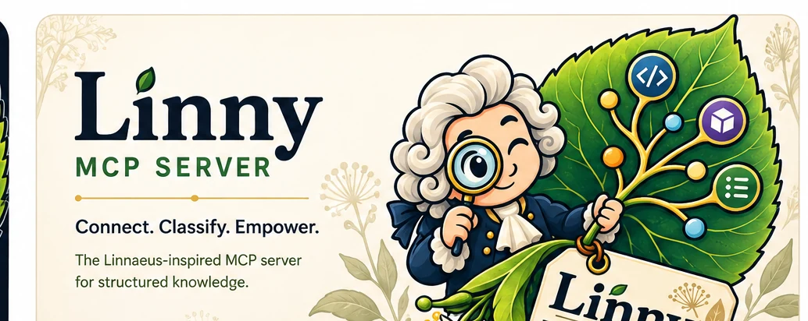

<p align="center">
  
</p>

<p align="center">
  <strong>Connect. Classify. Empower.</strong><br>
  <em>The Linnaeus-inspired MCP server for structured knowledge.</em>
</p>

<p align="center">
  <a href="LICENSE"></a>
</p>

# linny-mcp

A single Go binary that exposes a private markdown corpus — a Hugo/front-matter
based **Linny notebook** (thousands of flat `.md` files) — to AI agents over the
**Model Context Protocol (MCP)**.

Linny is named after **Carl Linnaeus**, the father of modern taxonomy: the notebook
*is* a living taxonomy, and the Hugo indexer this project succeeds is nicknamed
*Carl*.

This repository is the PoC / alpha base. It is consumed downstream as a Nix flake
input in [`mipnix`](https://github.com/mipmip/mipnix).

> [!IMPORTANT]
> ## Secret hygiene — the one rule that must never be broken
>
> **No token value may ever appear in a Nix option.** Nix option values land
> **world-readable in `/nix/store`**. The NixOS module therefore takes a
> **`tokensFile` path**, never a token literal — source it from
> `age.secrets.linny-mcp-tokens.path` with `owner` set to the service user.
>
> Corollaries baked into the code:
> - Bearer tokens are compared with `crypto/subtle.ConstantTimeCompare`, never `==`.
> - Auth failures return `401` with an empty body, no detail, and no timing signal.
> - The token file stores **hashes**, not raw tokens, where practical.
> - Every tool response passes through a gitleaks-style **egress redaction** filter,
>   so no response can return a credential regardless of what an agent asks for.

## What it is

- **Its own disposable index** (SQLite + FTS5), built from front matter, kept in
  `stateDir`. It is a cache: **never committed to git**, and deleting `stateDir` and
  rebuilding is always a valid recovery step.
- **A standalone indexer** (`cmd/lindexer`) that parses YAML front matter, builds the
  taxonomy graph, and emits the JSON index files that `linny.vim` already consumes —
  intended to eventually replace the Hugo indexer ("Carl").
- **Static bearer-token auth** (explicitly *not* OAuth), behind an `Authenticator`
  interface so OIDC can be added later without a rewrite.
- **Read-only degradation**: whenever the git working tree is conflicted or
  mid-rebase, the server refuses all writes until the tree is clean again.
- **A Nix flake** exporting a package, a NixOS module with a hardened systemd unit,
  overlays, dev shells, and `checks`.

## Repository layout

| Path | Purpose |
|-------------------------|-------------------------------------------------------|
| `cmd/linny-mcp`         | The MCP server binary (+ `gen-token` helper).         |
| `cmd/lindexer`          | The standalone indexer CLI (`build`/`watch`/`verify`).|
| `internal/index`        | Front-matter parsing, taxonomy graph, SQLite/FTS5, JSON emit. |
| `internal/auth`         | `Authenticator` interface + static bearer tokens.     |
| `internal/authz`        | Deny-by-default scopes, SQL-level filtering.          |
| `internal/gitsafe`      | Working-tree inspection, degraded mode, atomic writes.|
| `internal/redact`       | Gitleaks-style egress secret redaction.               |
| `internal/mcp`          | The versioned MCP tool surface.                       |
| `internal/config`       | Server configuration (designed for N notebooks).      |
| `nix/`                  | Flake package + NixOS module.                          |
| `docs/`                 | `linden-index-spec.md`, `tools.md`, `future.md`.      |
| `openspec/`             | Change proposals and specs (spec-driven development). |

## Development

```sh
nix develop          # Go toolchain, golangci-lint, hugo
go build ./...
go test ./...
nix flake check      # gates go test + golangci-lint for both supported systems
```

Supported systems: `x86_64-linux`, `aarch64-linux` (enumerated explicitly in
`flake.nix` — no `flake-utils`).

## How the work is organised

- **Milestones and epics** live in [beans](https://github.com/) (`beans list`).
- Each epic is delivered as an **OpenSpec change** under `openspec/changes/`; its
  tasks live in that change's `tasks.md`. A change is implemented, archived, and
  committed as one increment.

## Testing

Tests run against a **generated synthetic corpus** only. **The real private
`secondbrain` corpus is never used** by any build, test, or tool.

## License

MIT © Linden Project
